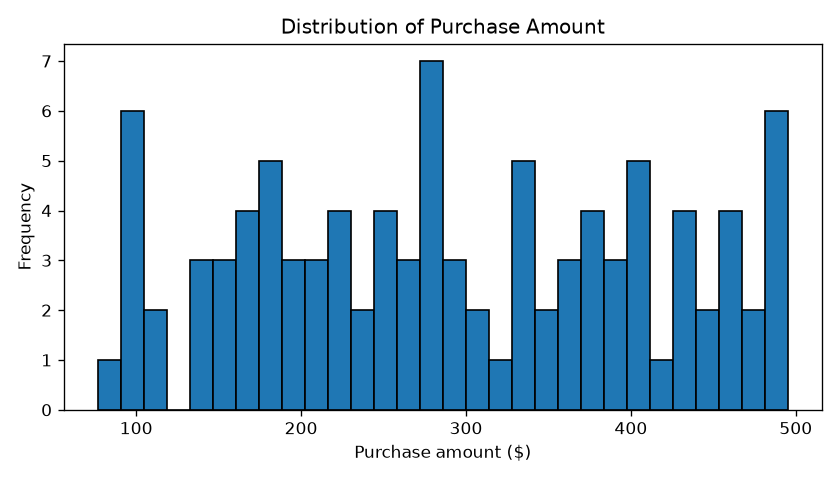
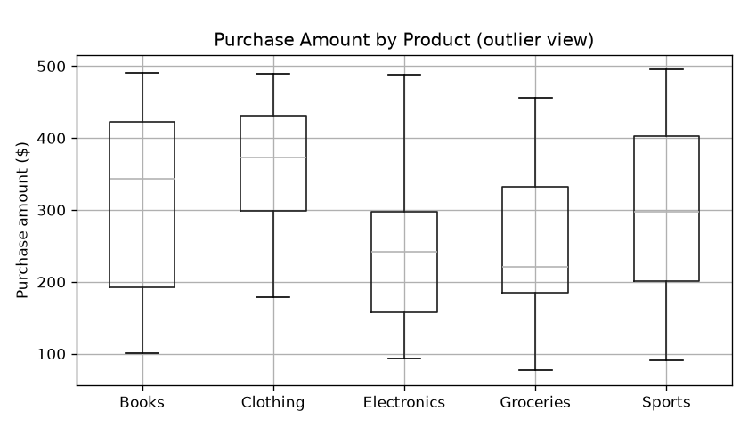
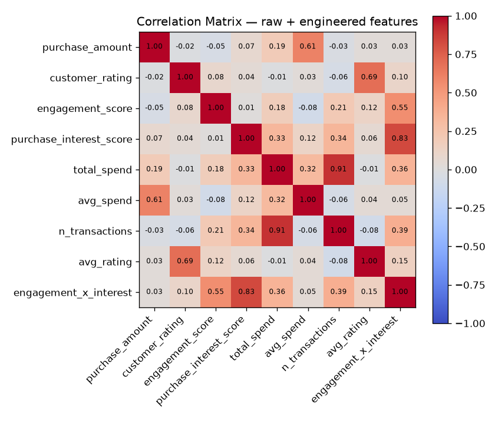
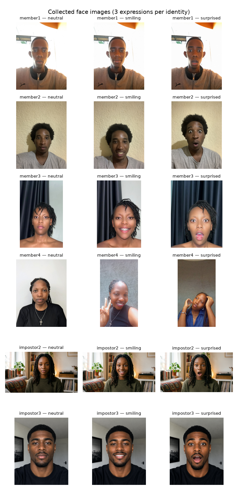
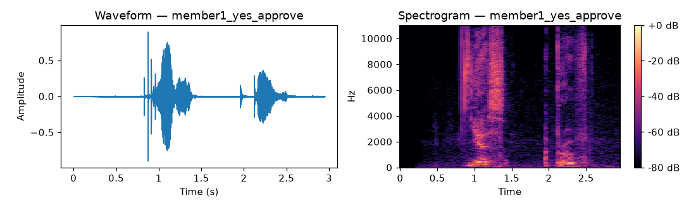

# Multimodal User Identity & Product Recommendation System

**Formative Assessment 2: Data Preprocessing** | **Group 8**

**Team:** Elvin Cyubahiro, Eddy Irasetsa, Iriza Larissa, Mutumwinka Heroine

**Repository:** https://github.com/Elvin100s/group-8-formative

**Simulation video:** https://youtu.be/5quay27JCxw

---

## 1. Overview

This project builds a transaction security pipeline: before a customer can receive a product recommendation, the system has to verify who they are twice, first by face and then by voice. If either check fails, the request ends with ACCESS DENIED and the recommendation model is never reached. We implemented the full flow from the assignment diagram as a command line application backed by three trained models, and every stage of the data work behind it, from merging the course datasets to collecting and processing our own face photos and voice recordings.

The flow we implemented:

```
User request -> Face recognition -> Voiceprint verification -> Product recommendation
                     |                      |
                 (no match)             (not approved)
                     v                      v
               ACCESS DENIED          ACCESS DENIED
```

## 2. Task 1: Data Merge, Cleaning and Exploratory Data Analysis

### 2.1 Purpose of the EDA

We performed exploratory data analysis to understand the data before building any models. The goal was to check that the data was clean, find missing values and duplicate records, see how the numerical features are distributed, and understand how the features relate to each other and to the purchase target.

### 2.2 Data merge

The two provided datasets do not share a customer identifier: `customer_transactions.csv` uses `customer_id_legacy` while `customer_social_profiles.csv` uses `customer_id_new`. We bridged them through the provided `id_mapping.csv` lookup table and used an inner join, because a usable training row needs both the purchase label (from transactions) and the predictor features (from the social profile). The mapping is many to many, and 97 rows survive the join, covering 37 distinct customers. After merging we checked the result to confirm the join behaved as expected.

### 2.3 Data cleaning

We dropped duplicate records, fixed column types (text encoded numbers cast to numeric, dates parsed), filled numeric nulls with the column median and categorical nulls with the mode. After merging we assert that the result contains zero nulls and no duplicated transactions. We also engineered aggregate features per customer: total spend, average spend and transaction count.

### 2.4 Data distribution



Purchase amounts are spread almost evenly from $77 to $495. There is no typical spend level and no dominant customer segment.

### 2.5 Outlier detection



The boxplots per product category show similar medians and ranges across all five categories. A few mild extremes exist and we kept them, because they represent real customer behaviour rather than errors in the data.

### 2.6 Correlation analysis



The heatmap is the most important finding of the EDA. Apart from the engineered aggregates correlating with each other (expected, since total spend is roughly average spend times transaction count), every off diagonal correlation is near zero. In particular, the social features (`engagement_score`, `purchase_interest_score`) do not correlate with purchase behaviour at all.

### 2.7 Key findings

The datasets merged successfully through the ID mapping and the cleaning steps left no nulls or duplicates. The distributions are flat, the outliers are mild and legitimate, and the correlation analysis warned us early that the tabular features carry little signal for predicting the product category. Section 5 confirms that warning with a baseline test. This finding shaped how we evaluated the product model, so the EDA did its job: it told us what the data could and could not support before we trained anything.

## 3. Task 2: Image Collection, Augmentation and Features

Each of the four team members contributed three photos (neutral, smiling, surprised), and we added two impostor identities with the same three expressions as negative examples, for 18 raw images total. Files follow a strict naming convention (`member2_neutral.jpg`, `impostor3_smiling.png`) so the pipeline can label them automatically. Photos arrived in mixed formats (HEIC, JPEG, PNG) and were converted to formats the pipeline can read before committing.



Each image gets three augmentations: rotation of up to 15 degrees with brightness jitter, horizontal flip, and grayscale conversion. That takes the set from 18 to 72 images. From every image we extract a normalized 32-bin grayscale histogram plus a 16x16 downsampled pixel embedding (256 values), giving a feature vector of 288 values per image, saved to `data/processed/image_features.csv` (72 rows).

## 4. Task 3: Audio Collection, Augmentation and Features

Every member recorded the two required phrases, "Yes, approve" and "Confirm transaction", and each member also collected the same two phrases from a person outside the team, giving four impostor voices. That makes 16 raw recordings. Recordings arrived as OPUS, M4A, MP4 and MPEG files from different phones; we converted everything to a uniform 22.05 kHz mono WAV before processing.

For every recording we plot the waveform and spectrogram (all 16 pairs are in `outputs/plots/`):



Each word shows up in the waveform as a burst of energy with silence in between, and the spectrogram shows most voice energy below about 4 kHz. MFCCs capture that spectral shape, which differs from speaker to speaker, and that is what makes voiceprint verification work.

Each clip gets three augmentations: pitch shift up two semitones, time stretch at 0.85x, and additive background noise, taking 16 clips to 64. From every clip we extract 13 MFCC means, 13 MFCC standard deviations, spectral roll-off, spectral centroid, RMS energy and zero-crossing rate, saved to `data/processed/audio_features.csv` (64 rows).

## 5. Task 4: Models and Evaluation

| Model | Algorithm | Input | Target |
|---|---|---|---|
| Face recognition | RandomForest | image features | authorized vs not |
| Voiceprint verification | StandardScaler + LogisticRegression | audio features | authorized vs not |
| Product recommendation | RandomForest | merged tabular features | product category |

All models use a stratified 70/30 train/test split (75/25 for the product model). Results on the held out test sets:

| Model | Accuracy | F1 (weighted) | Log loss |
|---|---|---|---|
| Face recognition | 1.00 | 1.00 | 0.11 |
| Voiceprint verification | 1.00 | 1.00 | 0.15 |
| Product recommendation | 0.20 | 0.19 | 1.62 |

**On the perfect authentication scores.** Separating a small set of known identities (six in the image data, eight in the audio) captured in controlled conditions is a genuinely easy closed set task, so high scores are expected. They are still optimistic: the split happens after augmentation, so augmented copies of a photo can land in both train and test, and the test sets are small (about 22 images and 20 clips). A grouped split would remove that leakage, but with only 18 source photos it would leave too few test samples for stable estimates, so we keep the simple split and state the caveat. The log losses (0.11 and 0.15) are not zero, which shows the models produce calibrated probabilities rather than memorized labels.

**On the 20% product accuracy.** This number is chance level, and we can show it is the data rather than the model. We compared the RandomForest against a majority class dummy classifier under 5 fold cross validation: the dummy reaches 0.25 and the RandomForest does not beat it. With 97 rows across five roughly balanced categories and features that the EDA already showed are uncorrelated with purchases, there is no signal to learn. We report this honestly instead of tuning hyperparameters until the test score looks better, which on a test set of 25 rows would just be overfitting noise. The pipeline is sound; given richer behavioural data the same code would pick up real signal.

## 6. Multimodal Decision Logic

The product model only runs if both biometric checks pass:

```
P(face authorized) >= 0.60  AND  P(voice authorized) >= 0.60
```

Either failure stops the pipeline at ACCESS DENIED. The two modalities are independent models over independent data, so an attacker has to beat both to reach the recommendation stage, which matches the assignment flow diagram.

## 7. Task 6: System Simulation (CLI)

`app.py` implements the full flow on the command line. A real authorized run with a team member's photo and voice:

```
$ python app.py --image data/images/raw/member1_smiling.jpg \
                --audio data/audio/raw/member1_yes_approve.wav --customer A176

 USER IDENTITY & PRODUCT RECOMMENDATION SYSTEM
============================================================
Step 1/3  Facial recognition
  [OK]   Face: P(authorized) = 0.98 (threshold 0.6)
Step 2/3  Voiceprint verification
  [OK]   Voice: P(authorized) = 0.94 (threshold 0.6)
Step 3/3  Product recommendation
  >>> RECOMMENDED PRODUCT: Sports <<<
  Top-3 probabilities: Sports (0.81), Groceries (0.09), Electronics (0.06)
Transaction complete.
```

An unauthorized attempt with an impostor photo is stopped at the first gate:

```
$ python app.py --image data/images/raw/impostor2_neutral.png \
                --audio data/audio/raw/member1_yes_approve.wav

Step 1/3  Facial recognition
  [DENY] Face: P(authorized) = 0.01 (threshold 0.6)
*** ACCESS DENIED - face not recognized. ***
```

The app also handles bad input gracefully: missing files, untrained models and audio in the wrong format all produce clear error messages instead of stack traces. Both runs above are also captured in the executed notebook.

## 8. Repository Structure

```
├── app.py                                 CLI simulation (Task 6)
├── Formative2_Multimodal_Pipeline.ipynb   executed notebook, full narrative
├── scripts/
│   ├── data_merge.py                      Task 1
│   ├── image_pipeline.py                  Task 2
│   ├── audio_pipeline.py                  Task 3
│   ├── train_models.py                    Task 4
│   └── build_notebook.py                  notebook generator
├── data/
│   ├── raw/                               course CSVs
│   ├── images/{raw,augmented}/            18 + 54 face images
│   ├── audio/{raw,augmented}/             16 + 48 recordings
│   └── processed/                         merged_dataset.csv, image_features.csv, audio_features.csv
├── models/                                3 trained models + metrics.json
└── outputs/plots/                         EDA, image grid, waveforms and spectrograms
```

## 9. Team Contributions

| Member | GitHub | Contributions |
|---|---|---|
| Elvin Cyubahiro | @Elvin100s | Repository setup and architecture; Task 1 merge and EDA script; CLI app (Task 6); media normalization to WAV/JPG; impostor face images; pipeline execution and integration; documentation |
| Eddy Irasetsa | @Eddydev-ALU | Task 3 audio pipeline; notebook builder; repository hygiene; member2 photos and recordings; impostor2 recordings |
| Iriza Larissa | @Larissa4-droid | Task 2 image pipeline; Task 4 model training and evaluation; member3 photos and recordings; impostor3 recordings |
| Mutumwinka Heroine | @h-mutumwinka | Data merge and data generation scripts; member4 photos and recordings; impostor4 recordings |

Individual work is verifiable in the commit history: https://github.com/Elvin100s/group-8-formative/commits/main

## 10. Limitations and Future Work

The main limitation is the tabular dataset: 97 rows with features unrelated to the purchase target cap the product model at chance level. With real behavioural data (purchase history depth, browsing events, product metadata) the identical pipeline would have signal to exploit. On the biometric side, a larger photo and recording set per member would allow a grouped train/test split, removing the augmentation leakage caveat and giving tighter performance estimates. The authentication threshold (0.60) could also be tuned against false accept and false reject tradeoffs if the system were deployed beyond a course demonstration.
